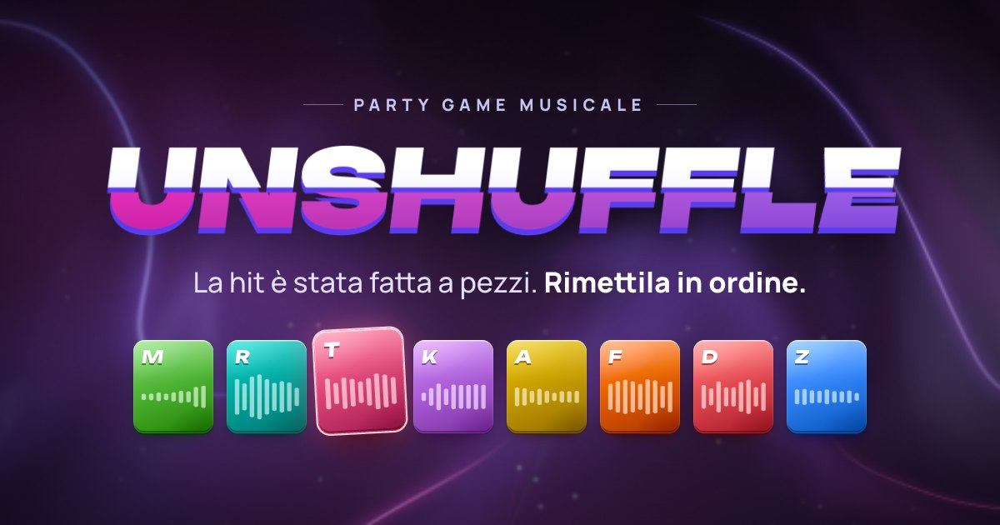

<p align="center">
  <a href="https://pages.arm.re/unshuffle/">
    
  </a>
</p>

<p align="center">
  <b><a href="https://pages.arm.re/unshuffle/">Play it at pages.arm.re/unshuffle</a></b><br>
  <sub>Free · no sign-up · phone or computer · 1 to 10 players</sub>
</p>

<br>

UNSHUFFLE is a music game you play with friends, right in the browser. Each round
takes a song, cuts it into pieces on the beat and shuffles them. You listen to the
pieces, drag them back into order and lock in your answer. As soon as someone
locks in, everyone else has a few seconds left.

Setting up takes a minute: one person creates a room, the others join from their
own phone with the code, the link or the QR code. You can also play on your own.

## How a game goes

**The lobby.** The host picks a Deezer playlist: search for one, browse the
featured ones or paste a link. Then the rules: how many rounds, how many pieces,
how much time.

**The round.** The song shows up as a row of shuffled tiles. Tap one to hear it,
drag it where you think it belongs, and press ▶ to hear the whole thing in your
order. When it sounds like the real song, lock in. The first player to lock in
starts the final countdown for everybody else.

**The reveal.** The original plays from the top while your tiles turn green or red
and slide into their right places. You can switch between your order and the
correct one, or tap any tile to jump to that part of the song. Then a quick look
at the standings, and on to the next song.

**The end.** A podium with confetti, everyone's points round by round, and a few
awards: Golden Ear, Quick Draw, Sniper, and Out of Time for whoever kept running
out of it. The setlist lets you listen to the songs again. The host can start a
new game straight away, and anyone can ask for a rematch.

## Scoring

A perfect round is worth 5,000 points. Half of it goes to tiles in exactly the
right spot, the other half to tiles that follow each other correctly, so if you
got the chorus together but put it in the wrong place, it still counts for
something. On equal points, whoever played more rounds wins, then whoever locked
in faster.

## Rules

| Setting         | Choices                                          |
| --------------- | ------------------------------------------------ |
| Rounds          | 3, 5, 7 or 10, one song each                     |
| Pieces per song | 6 (easy), 8 (normal), 12 (hard) or 16 (insane)   |
| Time per round  | 60, 90, 120 or 180 seconds                       |
| Final countdown | 10, 15, 20 or 30 seconds after the first lock-in |

## Details

- The cuts fall on beats and bar lines and try not to split a held note. Put the
  tiles in the right order and you hear the original song, with no gaps or clicks.
- Every song plays at the same loudness, so no round is suddenly louder than the
  one before.
- The game remembers which songs you've heard and picks the ones nobody in the
  room has heard lately, so the same playlist stays fresh for a few games. The
  history stays on your device and fades after a few weeks.
- It speaks ten languages: Italian, English, Spanish, French, German, Portuguese,
  Russian, Japanese, Korean and Chinese. Everyone in a room sees their own.
- If you reload the page or lose signal for a moment, you keep your seat and your
  points. If you join halfway through, you watch the current round and play from
  the next one.
- It's made for phones, but works just as well on a computer: Space plays your
  order, ⌘/Ctrl + Enter locks in, and holding a tile (or Shift + Enter) plays from
  that tile on.
- Add it to your home screen and it opens full screen, like an app.

## How it works

UNSHUFFLE is just a web page. There's no backend and no database: the browsers in
a room talk to each other directly, the host's browser keeps score, and the music
comes from the 30-second previews Deezer makes available to everyone. That's why
there are no accounts, and why it costs nothing to run.

It also means the host is the referee. If they close the tab, the game ends. If
their phone just goes to sleep for a bit, the game waits up to three minutes for
them to come back.

On home Wi-Fi, browsers find each other on their own. Players on mobile data, or
on strict office and school networks, can only connect through a relay server
(TURN), which the game has to be built with.

## Run your own

```sh
npm install
npm run dev
```

The game opens at http://localhost:5173. Open it in two browser windows to play
against yourself.

`npm run build` makes a static site in `dist/` that works from any host and any
folder. The build options, such as a TURN relay for players on mobile data or your
own signaling server, are described at the top of
[`src/net/peer.ts`](src/net/peer.ts). This repository publishes itself to GitHub
Pages on every push to `main`.

## Credits

Songs and album covers come from Deezer's public previews and belong to their
rights holders. UNSHUFFLE is an independent project, not affiliated with Deezer.
